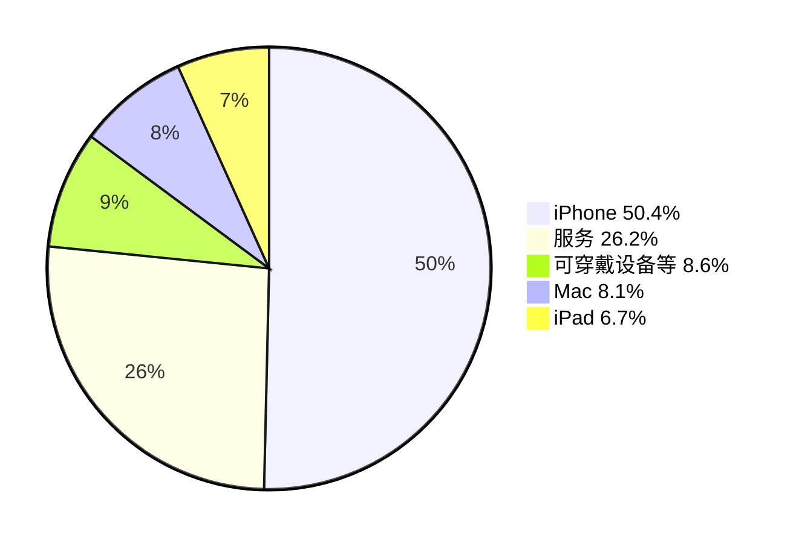

# 苹果2025财年财报总结

## 总体概览

苹果公司2025财年（截至2025年9月27日）交出了一份创纪录的成绩单。全年总营收达4161.61亿美元，同比增长6.4%；净利润达1120.1亿美元，同比增长19.5%，营收与利润双双实现强劲增长。第四财季（2025年7—9月）表现尤为亮眼，单季营收达1024.66亿美元，同比增长8%，创九月季度历史新高。财报发布后，苹果股价收于271.4美元/股，市值达4.03万亿美元，成为继英伟达和微软后美股市场第三家迈入“4万亿美元”俱乐部的公司。

> 收听苹果2025财年第四季度财报电话会议实录：
>
> https://www.xiaoyuzhoufm.com/episode/69044c189755cb9a6812a415
>
> （来源：小宇宙播客）

---

## 一、核心财务数据

从整体财务表现来看，苹果2025财年各项核心指标全面向好，盈利能力显著提升。全年毛利率达46.9%，第四季度毛利率进一步提升至47.18%。每股摊薄收益达1.85美元，同比增长91%，远超市场预期。经营活动现金流达297亿美元，同样创下九月季度纪录，期末现金及有价证券余额为1320亿美元。

苹果各产品线2025财年全年营收构成如下：

以上数据基于2025财年全年各产品线营收：iPhone 2095.86亿美元、服务 1091.58亿美元、可穿戴设备/家居/配件 356.86亿美元、Mac 337.08亿美元、iPad 280.23亿美元。服务业务全年收入首次突破1000亿美元大关，成为苹果第二大收入来源。

---

## 二、各产品线表现

### iPhone

iPhone全年营收达2095.86亿美元，同比增长4.2%，创历史新高。第四季度营收490.25亿美元，同比增长6%，iPhone活跃设备安装基数同样创下历史新高。不过，该季度iPhone营收略低于华尔街预期的501.9亿美元。

iPhone 17系列于9月19日开售，在本季度仅计入一周多的销售额。苹果CEO蒂姆·库克表示，iPhone 17“超出了预期”，多款机型均出现供应受限，需求远超预期。库克进一步透露：“我们审视了迄今为止的销售业绩，以及消费者对强大的iPhone产品线的反响。我们关注门店客流量，客流量同比显著增长，我们看到了全球范围内的热情。”

### Mac

Mac全年营收337.08亿美元，同比增长12.4%，成为本财年增长最亮眼的硬件品类。第四季度营收87.26亿美元，同比增长12.7%，同样超出华尔街预期的85.9亿美元。MacBook Air是增长的核心驱动力，新兴市场实现两位数增长，近半数Mac购买者为新用户。

### iPad

iPad全年营收280.23亿美元，同比增长5%。第四季度营收69.52亿美元，与去年同期基本持平。本季度苹果未发布新款iPad，但10月份已推出搭载升级版M5芯片的iPad Pro。

### 可穿戴设备、家居与配件

该品类全年营收356.86亿美元，同比下降3.6%，是唯一全年下滑的产品线。第四季度营收90.13亿美元，同比微降0.3%。Apple Watch和AirPods的增长被配件业务的下滑所抵消。

### 服务业务

服务业务是苹果增长最快、利润率最高的板块，全年营收达1091.58亿美元，同比增长13.5%，首次突破1000亿美元里程碑。第四季度营收287.5亿美元，同比增长15%。服务毛利率高达75.3%，远超硬件业务36.2%的毛利率水平。苹果首席财务官凯文·帕雷克预计，下一季度服务业务将继续保持类似增长态势。

---

## 三、区域市场分析

分区域来看，苹果在全球多数市场均实现增长，唯大中华区出现下滑。

| 区域 | 2025财年全年营收（亿美元） | 同比增长 |
|------|---------------------------|---------|
| 美洲 | 1783.53 | +6.8% |
| 欧洲 | 1110.32 | +9.6% |
| 日本 | 287.03 | +14.6% |
| 其他亚太地区 | 336.96 | +9.9% |
| 大中华区 | 643.77 | -3.8% |

第四季度各地区表现同样印证了这一分化态势：美洲441.92亿美元（+6%）、欧洲287.03亿美元（+15.2%）、日本66.36亿美元（+12%）、其他亚太地区84.42亿美元（+14.3%），而大中华区仅144.93亿美元，同比下降3.6%。

苹果管理层在财报电话会议中指出，大中华区收入下滑主要是由于iPhone Air在中国大陆的上市推迟。iPhone Air仅支持eSIM，受国内运营商支持进度影响，开售时间推迟至10月22日，其销售业绩未计入本季度财报。此外，中国本土品牌在中低端市场的激烈竞争，以及苹果在AI功能方面尚未形成明显优势，也对苹果在华表现造成了一定影响。

不过，库克对中国市场前景表示乐观：“我们预计，由于iPhone 17系列在中国的受欢迎程度，中国市场将在新财季恢复增长。”他同时指出，中国市场客流量同比大幅增长，iPhone 17系列市场接受度良好，苹果正在努力解决供应限制问题。

在谈到中国市场补贴政策时，库克表示，补贴覆盖了PC、平板电脑、智能手表及智能手机等多个品类，虽然苹果部分产品因售价高于补贴标准无法享受补贴，但整体而言补贴对销售产生了积极推动作用。

---

## 四、AI布局与未来展望

### AI战略进展

苹果正在大幅增加对人工智能的投入。公司正在构建AI私有云，用于支持Apple Intelligence的服务器已开始在美国休斯敦的工厂生产。苹果使用自己创建的基础模型，并在私有云中运行这些模型，同时还有多个模型在开发中。

库克透露，苹果正在推进更个性化Siri的开发，预计明年推出。同时，苹果将继续扩大AI合作生态，类似在Apple Intelligence中整合ChatGPT的模式，并对AI相关的并购交易持开放态度。M5芯片的发布也进一步强化了端侧AI算力，M5芯片的AI性能较前代提升了3.5倍。

### 未来业绩指引

展望2026财年第一财季（截至2025年12月底），苹果管理层给出了强劲的业绩预期。库克预计，在iPhone 17系列强劲需求的带动下，本季度营收将同比增长10%至12%，iPhone营收将实现两位数增长。库克还表示，这将有望成为苹果“有史以来最好的第一财季”。

毛利率方面，预计下一季度将在47%至48%之间，其中已包含约14亿美元关税相关成本的影响。运营支出预计在181亿至185亿美元之间，主要反映AI领域的持续投资。

### 资本回报

2025财年第四季度，苹果通过股息和股票回购向股东返还了240亿美元，其中股息及等价物39亿美元，股票回购200亿美元。

---

## 五、总结

2025财年是苹果创纪录的一年。全年营收突破4160亿美元，净利润超1120亿美元，市值突破4万亿美元，成为全球第三家达到这一里程碑的企业。iPhone全年营收创历史新高，服务业务首次突破1000亿美元大关，毛利率从2024财年的约44%提升至46.9%。

然而，挑战同样不容忽视。大中华区全年营收同比下降3.8%，是全球唯一下滑的主要市场。iPhone 17系列面临的供应限制问题也亟待解决。此外，关税政策带来的成本压力、全球反垄断监管趋严，以及苹果在AI领域的追赶压力，都是库克在新财年需要应对的重要议题。

随着iPhone 17系列的强劲势头延续至假日季，叠加Apple Intelligence功能的逐步落地，苹果在2026财年的表现值得持续关注。
